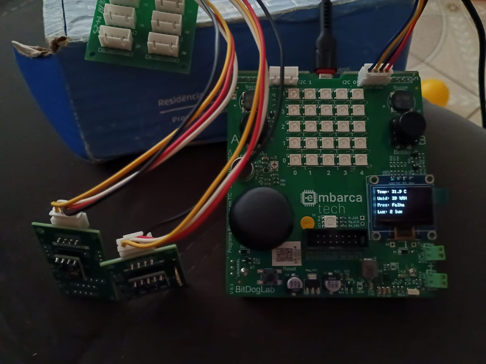
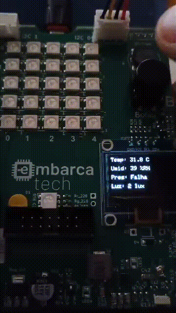
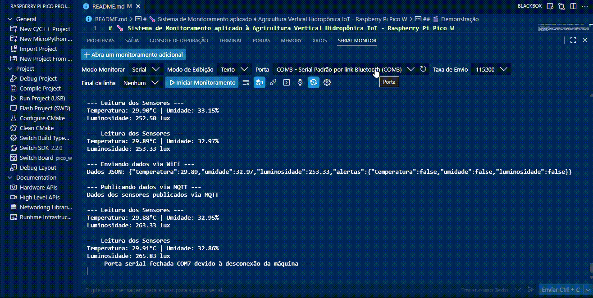
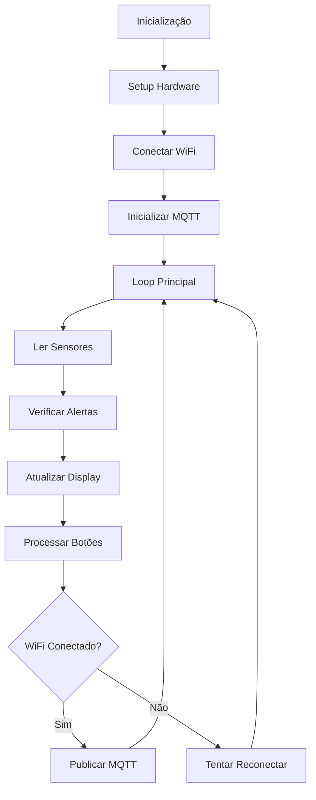

# 🌡️ Sistema de Monitoramento aplicado à Agricultura Vertical Hidropônica IoT - Raspberry Pi Pico W

## 📋 Descrição do Projeto

Este projeto implementa um **sistema completo de monitoramento aplicado à Agricultura Vertical Hidropônica IoT** utilizando o Raspberry Pi Pico W. O sistema realiza a coleta de dados ambientais (temperatura, umidade e luminosidade), exibe as informações em um display OLED, envia os dados via MQTT para brokers na nuvem e inclui um sistema de alertas para valores críticos.

### 🎯 Funcionalidades Principais

- **📊 Monitoramento em Tempo Real**: Coleta contínua de dados ambientais
- **📱 Interface Navegável**: Sistema de menus com navegação por botões
- **🌐 Conectividade IoT**: Publicação de dados via MQTT 
- **⚠️ Sistema de Alertas**: Notificações para valores críticos
- **📺 Display Visual**: Interface OLED para visualização local
- **🔄 Reconexão Automática**: WiFi e MQTT com recuperação automática

---

## 🎬 Demonstração

Veja abaixo o funcionamento do sistema:


### Tela de Medição





### Tela de Conexão





### Terminal com Alertas e Publicações MQTT





---

## 🛠️ Hardware Utilizado

### Componentes Principais

| Componente | Modelo | Função | Conexão |
|------------|--------|--------|---------|
| **Microcontrolador** | Raspberry Pi Pico W | Processamento e conectividade WiFi | - |
| **Sensor de Temperatura/Umidade** | AHT10 | Medição de temperatura e umidade | I2C (GPIO 0/1) |
| **Sensor de Luminosidade** | BH1750 | Medição de intensidade luminosa | I2C (GPIO 0/1) |
| **Display** | SSD1306 OLED 128x64 | Interface visual | I2C (GPIO 14/15) |
| **Botões** | Push Button x3 | Navegação nos menus | GPIO 5, 6, 22 |

### 📌 Pinout

```
Raspberry Pi Pico W
├── I2C0 (Sensores)
│   ├── SDA: GPIO 0 → AHT10 + BH1750
│   └── SCL: GPIO 1 → AHT10 + BH1750
├── I2C1 (Display)
│   ├── SDA: GPIO 14 → SSD1306 OLED
│   └── SCL: GPIO 15 → SSD1306 OLED
├── Botões
│   ├── BTN_A: GPIO 5 (Menu Anterior)
│   ├── BTN_B: GPIO 6 (Próximo Menu)
│   └── BTN_C: GPIO 22 (Reconectar WiFi)
└── WiFi: Integrado (CYW43)
```

---

## 🏗️ Arquitetura do Sistema

### 📁 Estrutura de Diretórios

```
projeto-final-joaonogueira/Etapa3/
├── app/
│   └── main.c                 # Aplicação principal
├── hal/                       # Hardware Abstraction Layer
│   ├── aht10.c               # Driver sensor AHT10
│   ├── bh1750.c              # Driver sensor BH1750
│   ├── display.c             # Interface de alto nível do display
│   ├── mqtt_client.c         # Cliente MQTT (baixo nível)
│   └── mqtt_server.c         # Gerenciador MQTT (alto nível)
├── drivers/                   # Drivers de baixo nível
│   ├── ssd1306.c             # Driver display SSD1306
│   └── font.c                # Sistema de fontes
├── include/                   # Headers
│   ├── aht10.h
│   ├── bh1750.h
│   ├── display.h
│   ├── font.h
│   ├── lwipopts.h            # Configurações lwIP
│   ├── mqtt_client.h
│   ├── mqtt_server.h
│   └── ssd1306.h
├── .vscode/                   # Configurações VS Code
├── CMakeLists.txt            # Configuração do build
├── lwipopts.h               # Configurações lwIP (root)
├── pico_sdk_import.cmake    # Import do Pico SDK
└── README.md                # Esta documentação
```

### 🔄 Fluxo de Funcionamento



---

## ⚙️ Configuração e Instalação

### 📋 Pré-requisitos

1. **Raspberry Pi Pico SDK** (versão 2.2.0)
2. **VS Code** com extensão Raspberry Pi Pico
3. **CMake** (versão 3.13+)
4. **Git** para controle de versão
5. **Acesso WiFi** (rede 2.4GHz)

### 🚀 Instalação

1. **Clone o repositório:**
```bash
git clone https://github.com/EmbarcaTech-2025/projeto-final-joaonogueira.git
cd projeto-final-joaonogueira/Etapa3
```

2. **Configure as credenciais WiFi:**
```c
// Em app/main.c, linhas 30-31
#define WIFI_SSID "SUA_REDE_WIFI"
#define WIFI_PASSWORD "SUA_SENHA_WIFI"
```

3. **Configure o broker MQTT (opcional):**
```c
// Em hal/mqtt_server.c, linha 21
mqtt_setup("pico_w_sensor", "91.121.93.94", &conct_status_mqtt);
```

4. **Compile o projeto:**
```bash
mkdir build && cd build
cmake ..
make -j4
```

5. **Flash no Pico W:**
```bash
# Segure BOOTSEL no Pico W e conecte USB
cp Etapa3.uf2 /path/to/RPI-RP2/
```

---

## 📊 Interface do Sistema

### 🖥️ Menus Disponíveis

O sistema possui **4 menus navegáveis** acessíveis pelos botões:

#### 📈 Menu 0: Medições dos Sensores
```
Temp: 23.5°C
Umid: 45%RH
Luz: 150 lux
```

#### 🌐 Menu 1: Status WiFi
```
WiFi: JOAO_2.4G
Status: Conectado
IP: 192.168.1.100
```

#### ⚠️ Menu 2: Alertas Críticos
```
Temp: OK
Umid: CRITICO
Luz: OK
```

#### 📡 Menu 3: Status MQTT
```
MQTT: Broker
Status: Conectado
```

### 🎮 Controles

| Botão | Função |
|-------|--------|
| **BTN_A (GPIO 5)** | Menu anterior |
| **BTN_B (GPIO 6)** | Próximo menu |
| **BTN_C (GPIO 22)** | Reconectar WiFi |

---

## 📡 Comunicação MQTT

### 🔧 Configuração MQTT

- **Broker**: `test.mosquitto.org` (91.121.93.94)
- **Porta**: 1883
- **Cliente ID**: `pico_w_sensor`
- **QoS**: 0

### 📤 Tópicos de Publicação

#### 1. Dados dos Sensores (`pico_w/sensors/data`)
**Intervalo**: 10 segundos
```json
{
  "temperatura": 23.50,
  "umidade": 45.20,
  "pressao": 0.00,
  "luminosidade": 150.5
}
```

#### 2. Alertas Críticos (`pico_w/sensors/alerts`)
**Intervalo**: 30 segundos (apenas quando há alertas)
```json
{
  "alerta": "critico",
  "temperatura_critica": false,
  "umidade_critica": true,
  "luz_critica": false
}
```

### 📊 Monitoramento Externo

Para monitorar os dados externamente, você pode usar:

**MQTT Client (mosquitto_sub):**
```bash
# Dados dos sensores
mosquitto_sub -h test.mosquitto.org -t "pico_w/sensors/data"

# Alertas
mosquitto_sub -h test.mosquitto.org -t "pico_w/sensors/alerts"
```

**Node-RED, Home Assistant, ou qualquer cliente MQTT**

---

## ⚠️ Sistema de Alertas

### 🎯 Limites Configurados

| Parâmetro | Limite | Condição de Alerta |
|-----------|--------|-------------------|
| **Temperatura** | 15°C - 35°C | Fora da faixa |
| **Umidade** | < 80% | Acima do limite |
| **Luminosidade** | > 50 lux | Abaixo do limite |

### 🚨 Indicadores de Alerta

- **LED Onboard**: Pisca quando há alertas críticos
- **Display OLED**: Mostra "CRITICO" nos valores fora dos limites
- **MQTT**: Publica mensagem de alerta no tópico específico

---

## 🔧 Personalização

### 📝 Alterar Limites dos Sensores

```c
// Em app/main.c, linhas 38-41
#define TEMP_MIN 15.0f      // Temperatura mínima (°C)
#define TEMP_MAX 35.0f      // Temperatura máxima (°C)
#define HUMIDITY_MAX 80.0f  // Umidade máxima (%)
#define LUX_MIN 50.0f       // Luminosidade mínima (lux)
```

### ⏱️ Ajustar Intervalos MQTT

```c
// Em app/main.c, linhas 35-36
#define MQTT_PUBLISH_INTERVAL_MS 10000  // Dados: 10 segundos
#define MQTT_ALERT_INTERVAL_MS 30000    // Alertas: 30 segundos
```

### 🌐 Configurar Broker MQTT Personalizado

```c
// Em hal/mqtt_server.c, linha 21
mqtt_setup("seu_client_id", "seu.broker.com", &conct_status_mqtt);
```

---

## 🛠️ Desenvolvimento

### 📚 Bibliotecas Utilizadas

- **Pico SDK**: Framework base para Raspberry Pi Pico
- **lwIP**: Stack TCP/IP para conectividade de rede
- **CYW43**: Driver WiFi para Pico W
- **Hardware APIs**: I2C, GPIO, Timer

### 🔄 Dependências CMake

```cmake
target_link_libraries(Etapa3 
    pico_stdlib                           # Biblioteca padrão
    hardware_i2c                          # Interface I2C
    pico_cyw43_arch_lwip_threadsafe_background  # WiFi + lwIP
    pico_lwip_iperf                       # Ferramentas de rede
    pico_lwip_http                        # HTTP (futuras expansões)
    pico_lwip_mqtt                        # Cliente MQTT
)
```

### 🧪 Debugging

**Serial USB habilitado:**
```c
pico_enable_stdio_usb(Etapa3 1)
pico_enable_stdio_uart(Etapa3 0)
```

**Monitor serial:**
```bash
# Windows (COM port)
putty -serial COM3 -sercfg 115200,8,n,1,N

# Linux/macOS
screen /dev/ttyUSB0 115200
```

---

## 🔍 Solução de Problemas

### ❌ Problemas Comuns

#### 1. **WiFi não conecta**
- ✅ Verificar SSID e senha
- ✅ Garantir que a rede seja 2.4GHz
- ✅ Verificar se há caracteres especiais na senha

#### 2. **MQTT erro 256**
- ✅ Verificar conectividade com a internet
- ✅ Testar com outro broker público
- ✅ Verificar firewall/proxy

#### 3. **Sensores não respondem**
- ✅ Verificar conexões I2C
- ✅ Confirmar endereços I2C (0x38 AHT10, 0x23 BH1750)
- ✅ Testar com pull-ups externos se necessário

#### 4. **Display em branco**
- ✅ Verificar conexões I2C1
- ✅ Confirmar endereço OLED (0x3C)
- ✅ Verificar alimentação 3.3V

### 🔧 Debug Via Serial

```c
printf("WiFi Status: %s\n", wifi_connected ? "Conectado" : "Desconectado");
printf("MQTT Status: %s\n", mqtt_connected ? "Conectado" : "Desconectado");
printf("Temp: %.2f°C, Hum: %.2f%%, Lux: %.2f\n", temp, hum, lux);
```

---

## 📈 Expansões Futuras

### 🚀 Funcionalidades Planejadas

- [ ] **Servidor HTTP**: Interface web para visualização
- [ ] **Logging SD Card**: Armazenamento local de dados
- [ ] **Sensores Adicionais**: Pressão atmosférica, qualidade do ar
- [ ] **Atuadores**: Controle de ventiladores, LEDs
- [ ] **Dashboard**: Interface gráfica avançada
- [ ] **OTA Updates**: Atualizações over-the-air

### 🔌 Compatibilidade

- **Raspberry Pi Pico W**: ✅ Totalmente suportado
- **Raspberry Pi Pico**: ❌ Requer adaptações (sem WiFi)
- **Other RP2040 boards**: ⚠️ Pode necessitar ajustes de pinout

---

## 📄 Licença

Este projeto está licenciado sob a **MIT License** - veja o arquivo [LICENSE](LICENSE) para detalhes.

---

## 👥 Contribuição

### 🤝 Como Contribuir

1. **Fork** o projeto
2. Crie uma **branch** para sua feature (`git checkout -b feature/AmazingFeature`)
3. **Commit** suas mudanças (`git commit -m 'Add some AmazingFeature'`)
4. **Push** para a branch (`git push origin feature/AmazingFeature`)
5. Abra um **Pull Request**

### 📋 Guidelines

- Seguir padrão de codificação existente
- Adicionar testes quando aplicável
- Documentar novas funcionalidades
- Manter compatibilidade com hardware existente

---

## 📞 Suporte

### 🆘 Onde Buscar Ajuda

- **Issues**: [GitHub Issues](https://github.com/EmbarcaTech-2025/projeto-final-joaonogueira/issues)
- **Documentação**: Este README e comentários no código
- **Raspberry Pi Foundation**: [Documentação oficial Pico](https://www.raspberrypi.org/documentation/microcontrollers/)

### 🏷️ Versão

**Versão Atual**: 1.0.0  
**Compatibilidade**: Pico SDK 2.2.0  
**Última Atualização**: Setembro 2025

---

## 🎖️ Créditos

### 👨‍💻 Desenvolvedor Principal
- **João Nogueira** - Desenvolvimento completo do sistema

### 📚 Recursos Utilizados
- [Raspberry Pi Foundation](https://www.raspberrypi.org/) - Pico SDK
- [lwIP](https://savannah.nongnu.org/projects/lwip/) - Stack TCP/IP
- [Eclipse Mosquitto](https://mosquitto.org/) - Broker MQTT de teste
- [SSD1306 Driver](https://github.com/daschr/pico-ssd1306) - Inspiração para driver do display

### 🏫 Programa Educacional
Este projeto foi desenvolvido como parte do programa **EmbarcaTech 2025**.

---

**⭐ Se este projeto foi útil para você, considere dar uma estrela no GitHub!**
